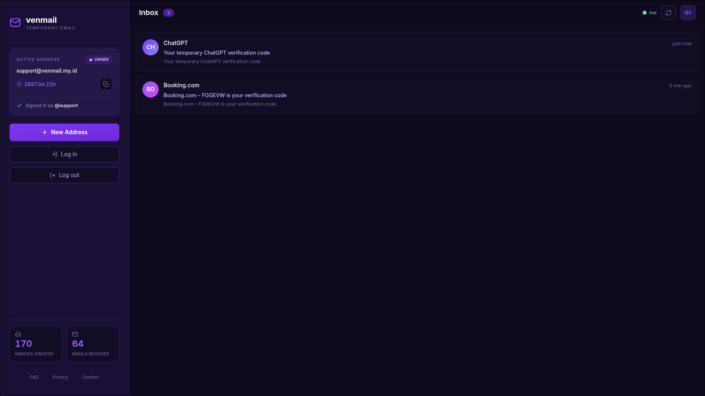
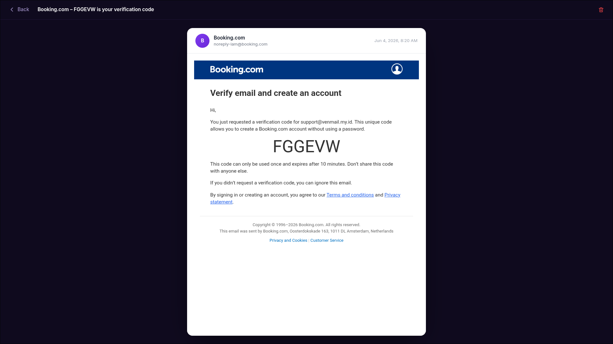
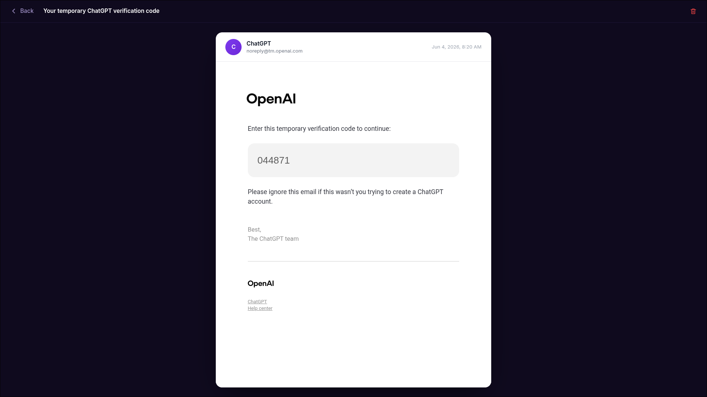
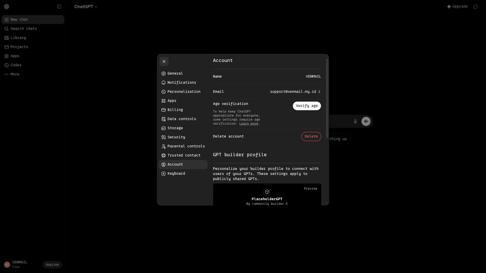

<div align="center">

# 📨 Venmail — Anonymous Temporary Email

### Privacy-first disposable inbox — get a working email address in one second, no signup. Built on the Cloudflare edge.

[](https://venmail.my.id)
[](#)
[](#)
[](#)

**🔗 Live demo: [venmail.my.id](https://venmail.my.id)**

</div>

---

> **Note on this repository**
> This is a **public showcase / case study** of a private project. It contains the product write-up and screenshots only — **the source code is proprietary and not included**. See [License](#-license).

---

## ✨ Overview

**Venmail** is a privacy-first **anonymous temporary email** service. Land on the site and you instantly get a real, working `@venmail.my.id` address — **no signup, no personal data, no tracking**. Incoming mail appears in real time. When you're done, the inbox simply expires and disappears.

Perfect for signing up to trials, verifying accounts, or anywhere you'd rather not hand over your real email. The whole thing runs **serverless on Cloudflare's edge** — globally fast and built to scale.

---

## ✨ Features

- ⚡ **Instant inbox, zero signup** — a random anonymous address is created automatically on your first visit.
- 📥 **Real-time mail** — new messages arrive within ~1 second, with desktop notifications and a sound alert.
- ✍️ **Custom address (optional)** — prefer your own name? Pick `you@venmail.my.id` and an optional password.
- 🔁 **Reusable across devices** — set a password and log back into the same inbox anywhere.
- 📧 **Full email reader** — clean HTML rendering (safely sandboxed), inline images, and a plain-text view.
- ⏳ **Auto-expiry for privacy** — inboxes and messages self-delete automatically; nothing lingers.
- 🌙 **Polished dark UI** — responsive, animated, and mobile-first.

---

## 📸 Screenshots

| Real-time inbox | Reading an email |
|---|---|
|  |  |

| Verification code, instantly | Used to sign up for a real service ✅ |
|---|---|
|  |  |

---

## 🛠️ Tech Stack

| Layer | Technology |
|---|---|
| **Frontend** | Next.js 14 (App Router), React 18, TypeScript, Tailwind CSS |
| **Hosting** | Cloudflare Pages (edge runtime, `@cloudflare/next-on-pages`) |
| **API / Backend** | Cloudflare Workers (TypeScript) |
| **Database** | Cloudflare D1 (SQLite) |
| **Inbound email** | Cloudflare Email Routing → Worker `email()` handler, MIME parsing with `postal-mime` |
| **Auth** | Stateless JWT (HMAC), HttpOnly cookies, PBKDF2 password hashing |
| **Tooling** | Wrangler, strict TypeScript, ESLint |

---

## 🏗️ Architecture

```
                    ┌──────────────────────────────┐
   Browser  ───────▶│  Next.js on Cloudflare Pages │
                    │  (edge runtime, dark UI)     │
                    └───────────────┬──────────────┘
                                    │  same-origin proxy
                                    │  (Service Binding, HttpOnly cookie ↔ JWT)
                                    ▼
                    ┌──────────────────────────────┐
   Inbound mail ───▶│      Cloudflare Worker        │───▶  D1 (SQLite)
   (Email Routing)  │  REST API + email() handler   │      accounts · inboxes · messages
                    └──────────────────────────────┘
```

**Design highlights**
- The browser never talks to the Worker directly — a **same-origin proxy backed by a Service Binding** forwards requests Worker-to-Worker. This sidesteps the cross-origin blocking, ad-blockers, and DNS filters that often break disposable-mail domains, and bridges the **HttpOnly JWT cookie** so tokens never touch JavaScript (XSS-safe).
- Clean **Account → Inbox → Message** data model with a sliding expiry that keeps active inboxes alive and quietly retires idle ones.
- Real-world **email engineering**: MIME + inline-image handling and sender-address normalization for a clean, readable inbox.

---

## 🔒 Privacy & Security

- **No signup, no personal data** — anonymous by default.
- **Auto-expiry** — inboxes and messages are deleted automatically; data doesn't pile up.
- **HttpOnly, Secure, SameSite cookies** — the JWT is never exposed to client-side JavaScript.
- **PBKDF2-HMAC-SHA256** hashing for optional passwords (per-user salt).
- **Sandboxed email rendering** — untrusted HTML runs in an `<iframe sandbox>` with scripts disabled.

---

## 📈 Engineering Highlights

- 100% **serverless on the edge** — sub-second responses, globally distributed, near-zero idle cost.
- **Strict TypeScript** across the frontend and the Worker; clean typecheck + build gates before every deploy.
- **Failure-safe by design** — email parsing and background cleanup degrade gracefully and never block delivery.

---

## 📄 License

**© 2026 Ksatria Bintang Samudra. All rights reserved.**

This repository is a portfolio showcase. The source code of Venmail is **proprietary and not licensed for reuse, copying, or distribution**. The text and screenshots here are provided for evaluation purposes only.

---

<div align="center">

**Built & maintained by Ksatria Bintang Samudra**

🌐 [venmail.my.id](https://venmail.my.id)

</div>
